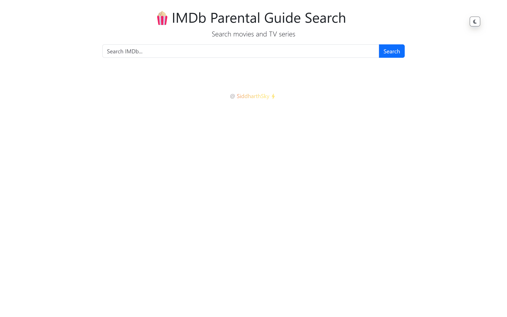
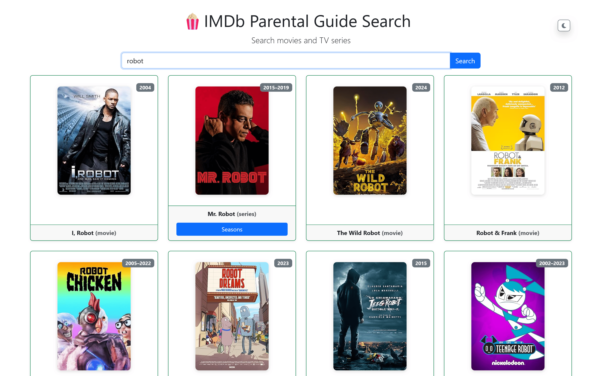
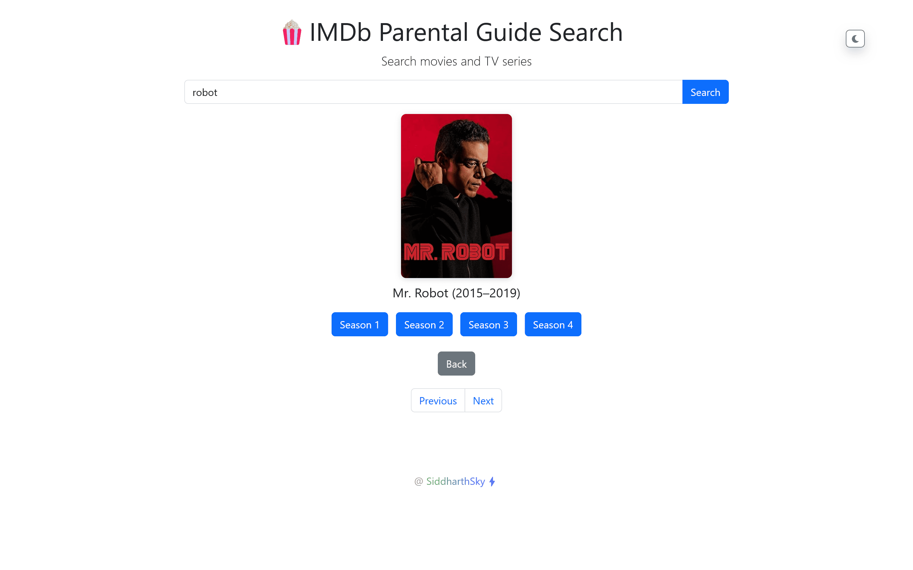
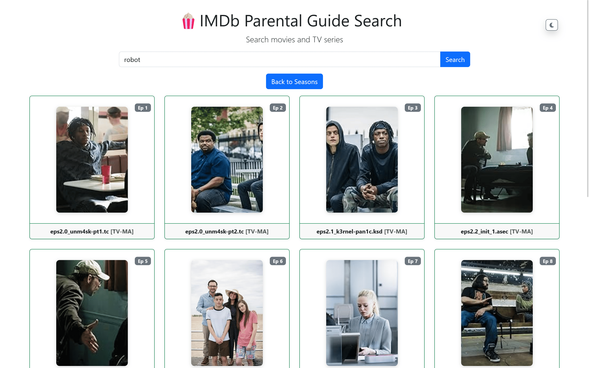

# IMDb Parental Guide Search 🍿

An interactive web app for searching movies and TV series, providing direct access to parental guide details. Powered by the OMDb API and styled with Bootstrap.

## Overview 🌐

The IMDb Parental Guide Search is designed to fetch detailed information about movies and TV series from the OMDb API. It offers a user-friendly interface to access parental guide data effortlessly.

## Features 🚀

- 🎬 Search and explore movies and TV series.
- 📺 Direct access to parental guide details.
- 🔍 Dynamic UI powered by Bootstrap.
- 🌐 Seamless integration with OMDb API for IMDb data.

## Technology Stack 🛠️

- **OMDb API**: Primary data source for IMDb content.
- **Bootstrap**: Ensures a responsive and visually appealing UI.
- **JavaScript**: Manages client-side functionalities.

## User Guide 📲

1. Open the web app - https://bit.ly/IMDb-parental-guide-search
2. Enter the movie or TV series name in the search bar.
3. Click the "Search" button.
4. Browse the displayed results and click on a title for more details.

## Screenshots 📸

<!--  -->

## Contributing 🤝

Contributions to the project are welcome! Feel free to submit pull requests or open issues to help us enhance the project.

## License 📜

This project is licensed under the MIT License. See the [LICENSE.md](LICENSE.md) file for details.

